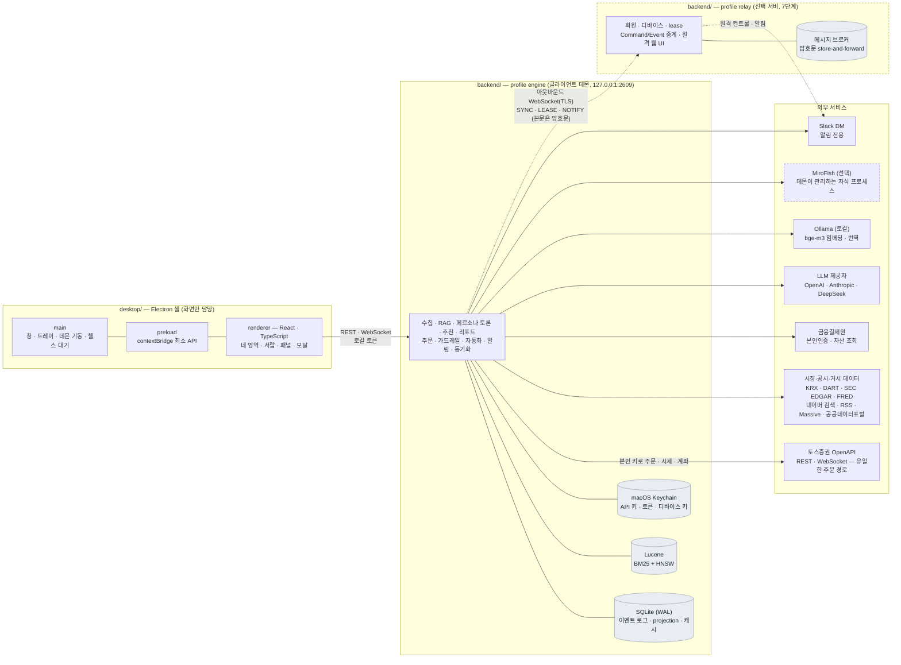
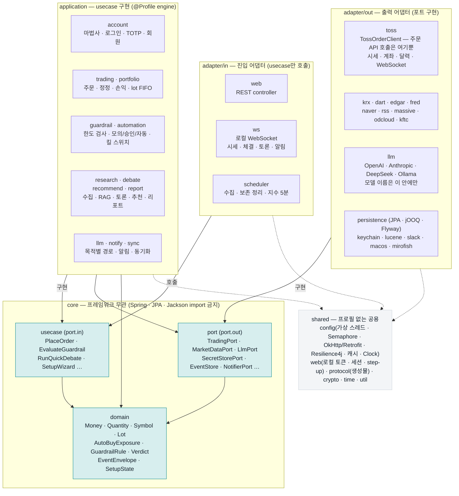

# Stockholm

[](docs/DEVELOPMENT_PLAN.md)
[](backend/gradle/libs.versions.toml)
[](backend/build.gradle.kts)
[](docs/TECH_STACK.md)
[](backend/gradle/wrapper/gradle-wrapper.properties)
[](desktop/package.json)
[](desktop/package.json)
[](desktop/tsconfig.base.json)
[](docs/DB_SCHEMA.md)
[](docs/TECH_STACK.md)
[](#라이선스)

여러 인격(페르소나)의 AI 토론과 시뮬레이션 결과를 근거로 주식 매수·매도 판단을 돕고, 토스증권 OpenAPI로 주문을 실행하는, 가족이 같이 사용하는 것을 전제로 한 **개인 프로그램**입니다. 국내 주식과 미국 주식을 다룹니다.

> **경고.** 이 프로그램은 실제 돈을 움직입니다. 어떤 산출물도 투자 조언이 아니며, 예측 정확도를 보장하지 않습니다. 자동 주문은 코드로 강제되는 가드레일 안에서만 일어나고, 테스트·개발 중에는 실제 주문 API를 호출하지 않습니다.

## 무엇을 하는가

| 영역 | 기능 |
|---|---|
| 매매 | 지정가·현재가 즉시 주문, 정정·취소, 조건주문(OCO/OTO), 보유·손익·거래내역 |
| 시세 | 실시간 차트(선/캔들), 호가, 급등락 순위, 지수 티커, 관심종목 |
| 정보 | 공시(DART·EDGAR), 재무·배당, 뉴스·RSS, 국민연금 해외투자 현황, 종목 커뮤니티 링크아웃 |
| AI | 페르소나 토론(매수·매도·산업 동향), 종목 추천, 시장 리포트, 성과 대조 학습 |
| 자동화 | 모의 실행 → 승인 후 실행 → 완전 자동의 단계적 전환, 노출액·건수·예수금 한도, 킬 스위치 |
| 가족 | 최대 4계정, 본인 키로 본인 계좌만, 선택적 relay 서버로 원격 컨트롤·디바이스 동기화·Slack 알림 |

## 구성

### 전체



### 백엔드 내부 — Hexagonal



의존은 위에서 아래로만 흐릅니다(`adapter → application → core.usecase/port → core.domain`). `engine`과 `relay`는 서로를 모르고 `core`·`shared`만 봅니다. 모든 외부 HTTP 호출에는 Resilience4j 서킷 브레이커와 fallback이 붙고, 모든 자동 주문은 `EvaluateGuardrailUseCase`를 거칩니다.

- 백엔드는 **Hexagonal Architecture**입니다. `core`(도메인·usecase·포트, 프레임워크 무관) 안쪽에 `engine`/`relay`(usecase 구현·어댑터·조립)가 있고, 의존은 `adapter → application → core.usecase/port → core.domain` 한 방향입니다. 경계는 ArchUnit 테스트가 빌드에서 강제합니다.
- 모든 업무 데이터는 클라이언트의 SQLite에 있습니다. 비밀값(API 키·토큰)은 macOS Keychain에만 있고 DB·설정·로그 어디에도 없습니다.
- 주문 API 호출은 토스증권 어댑터 한 곳(`TossOrderClient`)에만 존재합니다.

## 기술 스택

| 층 | 선택 |
|---|---|
| 런타임 | GraalVM for JDK 25 (LTS, JVM 모드) · Node 22 |
| 백엔드 | Kotlin 2.4 · Spring Boot 4.1 · ArchUnit · JPA + jOOQ(코드 생성 없음) · Flyway · SQLite(WAL) · Retrofit2/OkHttp · Resilience4j · Caffeine(또는 Valkey/Redis) · Lucene + Nori · Spring AI · 가상 스레드 |
| 데스크톱 | Electron 44 · Vite 7 / electron-vite · React 19 · TypeScript 5.9(strict) · TanStack Query · Zustand · Vitest |
| 프로토콜 | JSON Schema → quicktype(Kotlin·TypeScript 동시 생성) |
| 형식 | Spotless + ktfmt(kotlinlang) · ESLint + Prettier |

선택 이유·라이선스·쓰지 않기로 한 것은 [docs/TECH_STACK.md](docs/TECH_STACK.md)에 있습니다.

## 저장소 구조

```
stockholm/
├─ backend/     Spring Boot 단일 프로젝트 (Gradle Kotlin DSL)
│  └─ src/main/kotlin/banghak/stock/{core,engine,relay,shared}
├─ desktop/     Electron + React + TypeScript (main / preload / renderer)
├─ protocol/    JSON Schema와 타입 생성 스크립트
├─ scripts/     dev.sh · dist.sh · learning-tests.sh · db-dump.sh
├─ docs/        설계 문서 (INDEX.md 가 색인)
├─ CLAUDE.md    작업 규칙 (AGENTS.md 는 이 파일을 가리키는 입구)
└─ PROJECT.md   기준 문서 (목적 · 결정 · 기능 명세 · 자동화 규칙)
```

패키지·폴더 단위의 상세와 기능 → 위치 대응은 [docs/DIRECTORY_STRUCTURE.md](docs/DIRECTORY_STRUCTURE.md)를 참고하세요.

## 시작하기

요구 사항은 macOS(Apple Silicon), **GraalVM Community for JDK 25**, **Node 22**입니다. Gradle은 래퍼가 내려받습니다. JDK가 없으면 Gradle toolchain(foojay)이 GraalVM 25를 내려받습니다.

```bash
# 백엔드: 빌드 + 전체 테스트 (경계 검증 포함)
cd backend && ./gradlew build

# 백엔드: 데몬 실행 (127.0.0.1:2609, 상주 메모리 -Xmx384m)
cd backend && ./gradlew bootRun --args='--spring.profiles.active=engine'

# 데스크톱: 의존성 설치 후 검사·테스트·개발 실행
cd desktop && npm ci
npm run typecheck && npm run lint && npm test
npm run dev

# 한 번에: 데몬 + Electron 개발 실행 (Ctrl+C 로 둘 다 종료)
cd backend && ./gradlew dev

# 프로토콜 타입 생성 (Kotlin + TypeScript)
./protocol/generate.sh

# 배포 산출물: bootJar → jlink JRE → dmg (서명 없음)
./scripts/dist.sh
```

`npm ci` 뒤에 `electron-vite dev`가 "Electron uninstall" 오류를 내면 Electron 바이너리 내려받기가 건너뛰어진 것입니다. `node desktop/node_modules/electron/install.js`를 한 번 실행하면 됩니다.

외부 API 학습 테스트(`@Tag("learning")`)는 기본 빌드에서 제외되며 `./scripts/learning-tests.sh`로만 실행합니다. 키는 환경 변수로 넘기고, 어떤 학습 테스트도 주문 엔드포인트를 부르지 않습니다.

## 안전 규칙

코드보다 우선하는 규칙이며 어떤 편의를 위해서도 어기지 않습니다. 전문은 [CLAUDE.md](CLAUDE.md)의 "절대 규칙"에 있습니다.

1. 테스트·개발 중 실제 주문 API를 호출하지 않습니다. 주문 경로 테스트는 fake `TradingPort`만 씁니다.
2. 비밀값을 코드·설정·로그·픽스처·커밋에 넣지 않습니다. 키 값은 쓰기 전용입니다.
3. 가드레일을 우회하는 경로를 만들지 않습니다. 한도는 설정으로 낮출 수만 있습니다.
4. LLM 출력을 주문 파라미터로 직접 쓰지 않습니다.
5. 금액은 `BigDecimal` + 통화 코드입니다. 화면은 금액을 `number`로 계산하지 않습니다.
6. 주문은 토스증권 어댑터에서만 냅니다.
7. 로그에 계좌번호·키·토큰을 남기지 않습니다.
8. 모든 조회·명령은 `userId` 범위 안에서만 동작합니다. admin도 타인의 매매 데이터에 닿지 않습니다.

## 문서

| 문서 | 용도 |
|---|---|
| [docs/INDEX.md](docs/INDEX.md) | 문서 지도. 읽는 순서, 주제별·기능별·단계별 색인 |
| [docs/HANDOFF.md](docs/HANDOFF.md) | 지금 상태, 다음 작업, 미결 항목 |
| [docs/DEVELOPMENT_PLAN.md](docs/DEVELOPMENT_PLAN.md) | 0~9단계 착수 순서와 완료 기준 |
| [PROJECT.md](PROJECT.md) | 결정 D1~D21, 기능 F1~F23, 자동화 규칙, 화면 구성 |
| [CLAUDE.md](CLAUDE.md) | 작업 규칙(절대 규칙 · Clean Code 기반 코딩 규칙 · Git) |

## 상태

**1단계 리포 골격**을 진행 중입니다(2026-09-26). 백엔드·데스크톱 빌드 파이프라인과 경계 검증 테스트가 돌며, 다음은 `core` 값 객체 TDD → 이벤트 로그 → SQLite/Flyway V1 → Keychain → 데몬 기동 API → 최초 구동 마법사 순입니다([docs/DEVELOPMENT_PLAN.md](docs/DEVELOPMENT_PLAN.md) 3장).

## 라이선스

개인·가족 사용 목적의 비공개 프로젝트입니다. 오픈소스 라이선스를 부여하지 않았으며 재배포하지 않습니다. 토스증권 OpenAPI 이용 조건(본인 매매 목적 한정, 상업적 이용·제3자 배포 금지)을 따릅니다.
