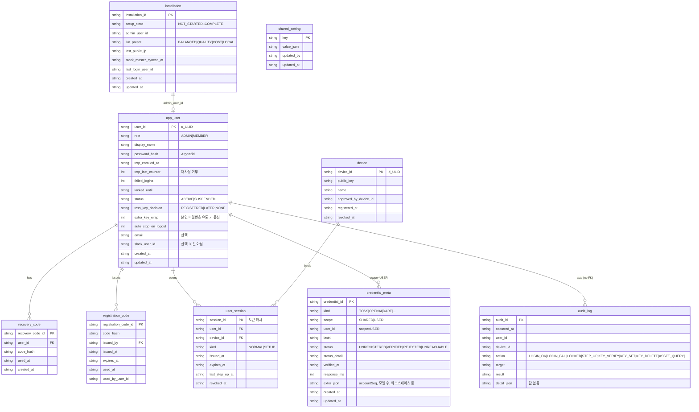
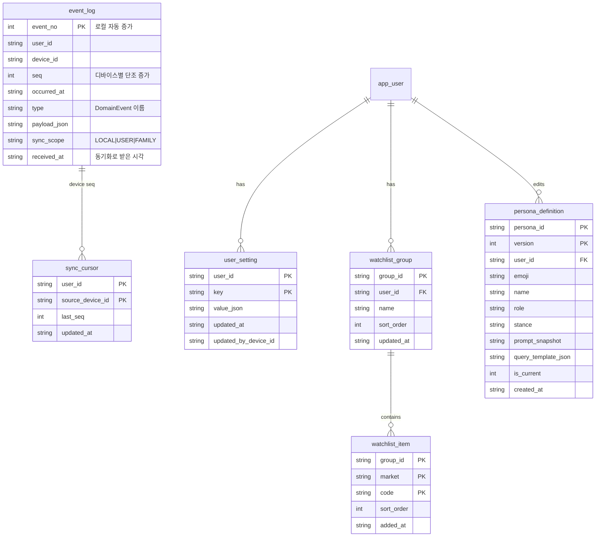
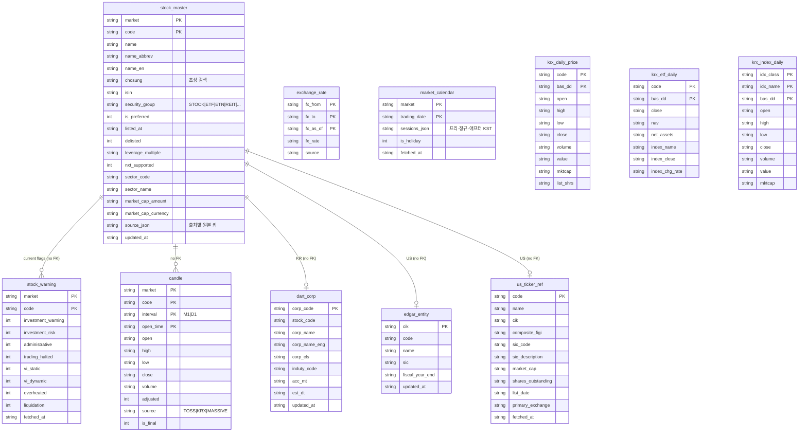
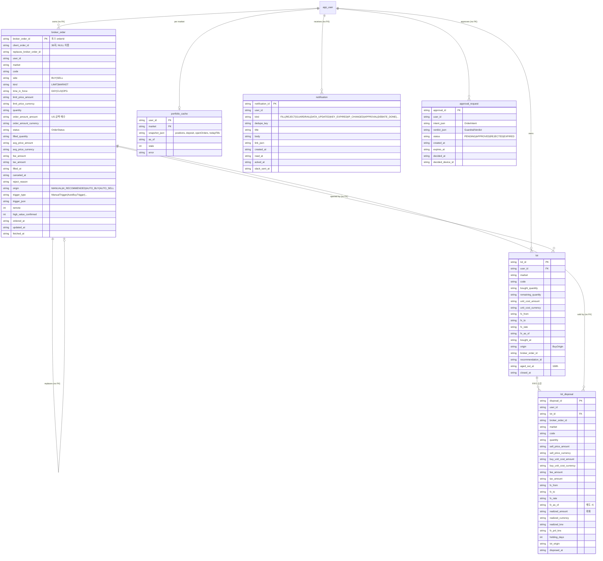
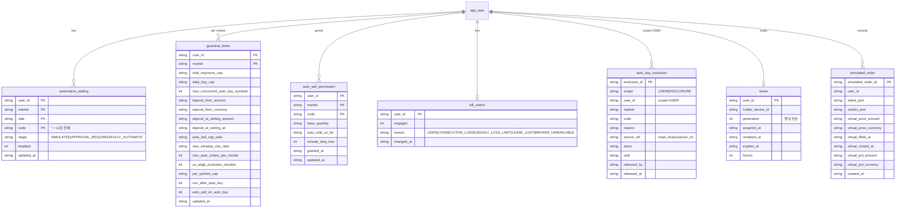
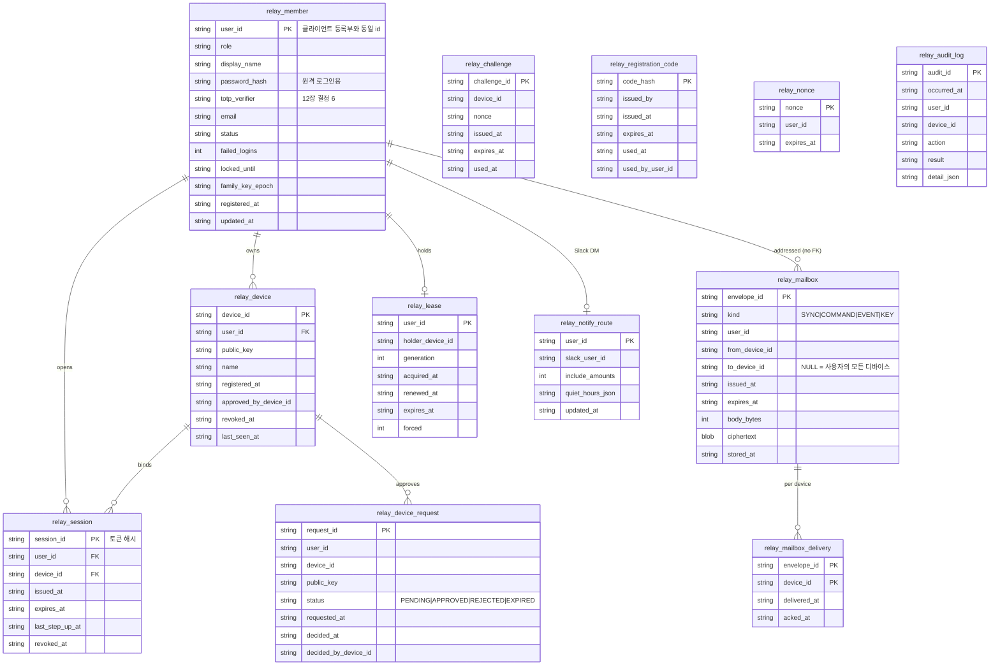

# DB 스키마 설계 (SQLite · Flyway)

> 문서 지도: [docs/INDEX.md](INDEX.md) · 기준 문서: [PROJECT.md](../PROJECT.md) · 작업 규칙: [CLAUDE.md](../CLAUDE.md) · 개발 순서: [DEVELOPMENT_PLAN.md](DEVELOPMENT_PLAN.md)

작성: 2026-09-25 / 상태: **[확정 2026-09-25]** — 12장의 결정 1·6·9(BigDecimal TEXT, relay TOTP는 클라이언트 검증, 보존 기간)는 사용자 승인, 정합성 항목 3·4·5·7·8·10은 관련 문서에 반영 완료. 남은 것은 11(메일박스 30일, 제안)과 12(정정 주문 clientOrderId 승계, 확인 필요). 각 설계 문서가 정한 표(`installation`, `credential_meta`, `broker_order`, `pension_*`, `financial_*`, `knowledge_*`)를 그대로 받고, 나머지는 기능 서술에서 끌어냈다. 결정 대기 항목은 12장 / 관련: [`PROJECT.md`](../PROJECT.md) 6장(데이터와 동기화)·11.1, [`CLAUDE.md`](../CLAUDE.md) 시스템 절, [`docs/CORE_DOMAIN.md`](CORE_DOMAIN.md) 9장(이벤트 로그), 각 기능 설계 문서의 "저장" 절

## 1. 결론 요약

- **SQLite(WAL) 파일 하나가 클라이언트 데몬(`engine`)의 저장소**다. relay 서버는 **별도 파일·별도 Flyway 이력**(`relay.db`)이며 Mac mini에서 두 프로필을 한 JVM에 올려도 파일은 나뉜다. MySQL은 relay에서만 프로필 전환 옵션이다.
- 표는 성격이 네 가지다. **① 이벤트 로그**(추가 전용, 동기화의 원천) → **② projection**(화면·규칙용, 이벤트에서 다시 만들 수 있음) / **③ 외부 데이터 캐시**(증권사·공시·시세, 동기화 안 함, 다시 받을 수 있음) / **④ 설치·계정 상태**(마법사, 사용자, 자격 메타). 표마다 이 구분을 적었고, 구분이 곧 백업·복구·삭제 정책이다.
- **FK는 관계도에 모두 그리되 물리 FK는 보수적으로 건다**(3.4). 기준은 "부모가 작고 안정적이며, 자식은 부모와 함께 지워지는 것이 맞고, 적재 순서가 항상 부모 → 자식"인 경우뿐이다. 캐시 표, 이벤트 로그, 증권사 주문 체인, 외부 식별자 참조에는 물리 FK를 두지 않는다.
- **금액·수량·비율은 `BigDecimal`을 문자열로 저장**한다(`${decimal}` 자리표시자). SQLite의 NUMERIC 친화성은 15자리를 넘는 소수를 REAL로 바꿔 정밀도를 잃는다. 합계·정렬은 Java가 한다.
- **시각은 UTC ISO-8601 문자열**(`2026-09-25T03:12:00.123Z`), 날짜는 `YYYY-MM-DD`, 불리언은 0/1, 식별자는 ULID 문자열(접두 `u_`·`d_`), JSON은 TEXT. MySQL 전환은 Flyway 자리표시자와 벤더별 `location`으로 흡수한다(3.3).
- **비밀값·계좌번호는 어떤 표에도 없다.** 키는 Keychain, 계좌는 끝 4자리와 `accountSeq`만, 비밀번호·복구 코드는 Argon2id 해시만.
- Flyway 버전은 개발 단계와 나란히 간다(11장). 1단계(V1)에는 설치·계정·자격·이벤트 로그·설정·종목 마스터가 들어간다.

## 2. 표 목록 (한눈에)

| 묶음 | 표 | 성격 | 범위 | 단계 |
|---|---|---|---|---|
| 설치·계정 | `installation` `app_user` `recovery_code` `registration_code` `device` `user_session` `credential_meta` `shared_setting` `audit_log` | ④ | 설치 / 사용자 | 1 |
| 이벤트·동기화 | `event_log` `sync_cursor` `user_setting` `watchlist_group` `watchlist_item` `persona_definition` | ①② | 사용자 | 1 |
| 종목·시세 | `stock_master` `stock_warning` `candle` `exchange_rate` `market_calendar` `market_index_quote` `krx_daily_price` `krx_etf_daily` `krx_index_daily` `dart_corp` `edgar_entity` `us_ticker_ref` | ③ | 설치 공용 | 1~2 |
| 주문·보유 | `broker_order` `lot` `lot_disposal` `portfolio_cache` `notification` `approval_request` | ③② | 사용자 | 2, 6 |
| 자동화 | `automation_setting` `guardrail_limits` `auto_sell_permission` `kill_switch` `auto_buy_exclusion` `lease` `simulated_order` | ② | 사용자 | 6, 8 |
| 지식·공시·재무 | `knowledge_document` `knowledge_symbol` `index_status` `symbol_alias` `kr_disclosure` `us_disclosure` `financial_fact` `financial_statement` `dividend_payment` `dividend_yield_weekly` `dividend_upcoming` `industry_profile` `sentiment_snapshot` `translation_cache` `translation_glossary` `journal_memo` `etf_composition` `etf_digest` | ③(정정은 버전) | 설치 공용 / 사용자 | 3 |
| 연기금 | `pension_dataset` `pension_holdings_snapshot` `pension_holding` `pension_holdings_change` `pension_symbol_alias` `pension_check_log` | ③ | 설치 공용 | 3 |
| 토론·추천·리포트 | `debate_session` `debate_participant` `debate_utterance` `debate_intervention` `debate_material` `debate_verdict` `stock_outlook_digest` `industry_digest` `related_symbol` `recommendation` `market_report` | ②③ | 사용자 / 공용 | 4 |
| 학습 | `prediction_outcome` `persona_weight` `persona_weight_history` `retrospective` `llm_usage` `llm_route` `llm_route_history` `llm_budget` `llm_price` | ②④ | 사용자 / 설치 | 4~5 |
| relay (별도 DB) | `relay_member` `relay_device` `relay_device_request` `relay_session` `relay_challenge` `relay_registration_code` `relay_mailbox` `relay_mailbox_delivery` `relay_lease` `relay_nonce` `relay_notify_route` `relay_audit_log` | ④ | 서버 | 7~8 |

SQLite 예약어와 겹치는 `user`, `session`은 `app_user`, `user_session`으로 쓴다.

## 3. 공통 규칙

### 3.1 이름과 형식

- 표·열은 `snake_case` 단수. PK는 표 이름 + `_id`(예: `lot_id`), 자연키가 있으면 자연키(`broker_order_id`, `rcept_no`, `accession_no`).
- 모든 표에 `created_at`. 갱신되는 표에는 `updated_at`. 외부에서 받은 자료에는 `fetched_at` 또는 `first_seen_at`(기준 시점 원칙).
- 종목은 항상 `market`(`KR`/`US`) + `code` 두 열. 한 열로 합치지 않는다(`Symbol` 값 객체와 1:1).
- 금액은 `*_amount` + `*_currency`(`KRW`/`USD`) 쌍. 통화가 표 단위로 고정되면 열 하나로 줄이지 않고 그래도 둘 다 둔다(합산 실수 방지).
- 환율은 `fx_from`, `fx_to`, `fx_rate`, `fx_as_of` 네 열(`ExchangeRate`).
- 비율(`Percent`)은 0.9 = 90%로 저장한다.
- enum은 TEXT로 저장하고 값은 Java enum 이름 그대로(`FILLED`, `AUTO_BUY`). 정수 코드를 쓰지 않는다.

### 3.2 형식 자리표시자 (Flyway placeholder)

| 자리표시자 | SQLite | MySQL | Java |
|---|---|---|---|
| `${id}` | `TEXT` | `VARCHAR(32)` | `String`(ULID) |
| `${decimal}` | `TEXT` | `DECIMAL(24,8)` | `BigDecimal` + `AttributeConverter<BigDecimal,String>` |
| `${instant}` | `TEXT` | `VARCHAR(30)` | `Instant` ↔ ISO-8601 UTC, 밀리초 3자리 고정, `Z` |
| `${date}` | `TEXT` | `DATE` | `LocalDate` |
| `${bool}` | `INTEGER` | `TINYINT(1)` | `boolean` 0/1 |
| `${json}` | `TEXT` | `JSON` | 문자열, 직렬화는 `shared` |
| `${text}` | `TEXT` | `TEXT` | 긴 본문 |
| `${blob}` | `BLOB` | `LONGBLOB` | 암호문(relay만) |

- ISO-8601 문자열은 사전순 = 시간순이라 범위 조회와 정렬이 인덱스로 된다. 정수 epoch보다 읽기 쉬워 운영·디버깅에 유리하다. 밀리초 자릿수를 고정해야 정렬이 깨지지 않는다.
- SQLite는 열 길이·타입을 강제하지 않으므로 **길이·형식 검증은 값 객체 생성자**(`Money`, `Quantity`, `ClientOrderId` 36자)가 한다. DB는 마지막 방어선이 아니라 저장소일 뿐이다.
- `${decimal}`을 TEXT로 두면 SQLite에서 `SUM`·`ORDER BY`가 문자열 기준이 된다. 손익·통계·노출액 합산은 모두 Java(`BigDecimal`)에서 한다. 큰 표에서 정렬이 필요하면 정렬 전용 정수 열(`*_minor`, 최소 단위 정수)을 따로 둔다 — 지금은 필요한 곳이 없다.

### 3.3 Flyway 배치

```
backend/src/main/resources/db/
├─ engine/                # engine 프로필 DataSource, 파일 stockholm.db
│  ├─ common/V1__…sql … # 벤더 공통(자리표시자 사용)
│  └─ sqlite/            # 벤더 전용이 꼭 필요할 때만(지금은 비어 있음)
└─ relay/                 # relay 프로필 DataSource, 파일 relay.db 또는 MySQL
   ├─ common/
   ├─ sqlite/
   └─ mysql/
```

- `spring.flyway.locations`는 프로필별로 `db/engine/common,db/engine/{vendor}` 형태. 자리표시자 값은 `application-{profile}.yml`에서 벤더별로 넣는다.
- 한 JVM에 `engine,relay`를 함께 올릴 때는 **DataSource 두 개, Flyway 두 개, JPA EntityManagerFactory 두 개**(패키지로 분리: `engine.persistence`, `relay.persistence`). ArchUnit이 두 패키지의 상호 참조를 막는다.
- SQLite 연결 설정: `journal_mode=WAL`, `synchronous=NORMAL`, `foreign_keys=ON`(연결마다), `busy_timeout=5000`. 커넥션 풀은 쓰기 1개로 직렬화한다(SQLite는 쓰기 단일 — 주문·lease·노출액 계산의 직렬화 지점이기도 하다).
- 이미 적용된 마이그레이션 파일은 고치지 않는다(CLAUDE.md). 열 삭제·타입 변경은 SQLite에서 표 재생성이므로 새 버전에서 `CREATE … AS SELECT` 방식으로 한다.

### 3.4 FK 정책

논리 FK는 4~10장 관계도에 전부 그린다. 물리 FK(`REFERENCES … ON DELETE …`)는 아래 기준을 **모두** 만족할 때만 건다.

1. 부모가 작고 안정적인 표다(`app_user`, `device`, `debate_session`, `knowledge_document`, `pension_holdings_snapshot`).
2. 자식은 부모 없이 의미가 없고, 부모를 지울 때 함께 지워지는 것이 맞다(`ON DELETE CASCADE`).
3. 적재 순서가 언제나 부모 → 자식이다(외부에서 자식이 먼저 도착할 수 있으면 금지).
4. 두 표가 같은 DataSource·같은 마이그레이션 묶음에 있다.

물리 FK를 **두지 않는** 곳과 이유:

| 대상 | 이유 |
|---|---|
| `event_log`, `sync_cursor` | 추가 전용·대량. 다른 디바이스에서 온 이벤트는 사용자 등록부보다 먼저 도착할 수 있다. 참조 무결성은 애플리케이션이 `userId` 범위로 보장 |
| `broker_order.replaces_broker_order_id` | 증권사 주문 목록은 정정 주문이 원주문보다 먼저 페이지에 올 수 있다. 체인은 조회 후 애플리케이션이 잇는다 |
| `lot.broker_order_id`, `lot.recommendation_id` | 주문 캐시는 다시 받을 수 있는 자료라 지워질 수 있고 lot은 남아야 한다 |
| 캐시 표 ↔ `stock_master` | 마스터는 매일 통째로 바뀌고 상장폐지 종목의 과거 자료는 남아야 한다 |
| `knowledge_symbol`·`sentiment_snapshot` ↔ `stock_master` | 위와 같음 |
| `financial_statement.supersedes_id` 등 버전 체인 | 백필 순서가 보장되지 않는다 |
| `pension_symbol_alias`, `symbol_alias` | 사용자 편집분이 마스터보다 오래 산다 |
| `notification.user_id`, `audit_log.user_id` | 사용자 삭제 뒤에도 기록은 남긴다 |
| relay `relay_mailbox` ↔ `relay_device` | 디바이스 폐기 뒤 남은 암호문은 만료 정리 작업이 지운다 |

물리 FK를 **두는** 곳: `recovery_code`, `user_session`, `credential_meta(user)`, `user_setting`, `watchlist_*`, `persona_definition`, `automation_setting`, `guardrail_limits`, `auto_sell_permission`, `kill_switch`, `lot(user)`, `debate_*` 자식 → `debate_session`, `knowledge_symbol` → `knowledge_document`(네이버 일괄 삭제가 CASCADE로 끝남), `pension_holding` → `pension_holdings_snapshot`, `pension_holdings_change` → 스냅샷, `debate_verdict` → `debate_session`, relay의 `relay_device`·`relay_session` → `relay_member`. SQLite에서는 연결마다 `PRAGMA foreign_keys=ON`이 없으면 FK가 무시되므로 DataSource 초기화 SQL에 넣고 통합 테스트로 확인한다.

### 3.5 사용자 범위와 삭제

- 사용자 소유 표는 모두 `user_id` 열을 갖고 **모든 인덱스의 첫 열이 `user_id`**다. 리포지터리는 `userId`를 받지 않는 조회 메서드를 갖지 않는다(ArchUnit로 이름 검사).
- 사용자 정지·탈퇴는 `app_user.status`만 바꾼다. 데이터 삭제는 admin이 "데이터 파기"를 별도로 실행할 때만 하며, 그때 `event_log`·`audit_log`·`broker_order`는 남기고 projection·설정·토론만 지운다(감사 원천 보존).

## 4. 설치·계정·자격 (V1)



- `installation`은 항상 한 행(`installation_id`는 설치 ULID, 이벤트 로그의 `device_id`와는 별개). `setup_state` 전이는 5단계뿐이며 서비스가 검사한다.
- `app_user`의 `email`·`slack_user_id`는 비밀값이 아니라 DB에 둔다(F21). `app_user`는 최대 4행. 5번째 삽입은 서비스가 막고, 테스트에서 확인한다(DB 제약으로 표현하지 않는다 — 벤더마다 방법이 달라서).
- `credential_meta` 유일 키 `(kind, scope, user_id)`. `extra_json`은 종류별 부가 메타(토스: 계좌 끝 4자리·`accountSeq`, Ollama: 주소·모델 목록, Slack: 워크스페이스, Massive: 등급). SEC 연락처 이메일은 비밀이 아니므로 `shared_setting`에 둔다(`sec.contact_email`).
- `shared_setting`은 admin 공유 설정의 키-값(SEC 이메일, KRX 이용 신청 만료일, LLM 예산 상한 등). `user_setting`(5장)과 같은 구조이되 사용자 열이 없다.
- `audit_log`는 **이벤트로 표현되지 않는 감사**(로그인·잠금·step-up·키 등록·검증·삭제·자산 조회·데이터 파기)만 담는다. 주문 감사는 `event_log`의 `OrderIntended → GuardrailEvaluated → OrderSubmitted → …` 연쇄 자체다(CORE_DOMAIN 9장). 두 곳에 같은 일을 쓰지 않는다. `detail_json`에 키 값·계좌번호·응답 원문을 넣지 않는다(테스트에서 표식 값 검색).

인덱스: `app_user(status)`, `user_session(user_id, expires_at)`, `credential_meta(kind, scope, user_id) UNIQUE`, `audit_log(occurred_at)`, `audit_log(user_id, occurred_at)`.

## 5. 이벤트 로그와 projection (V1)



- `event_log` 유일 키 `(user_id, device_id, seq)`. `seq`는 **(사용자, 디바이스) 쌍마다** 단조 증가한다. 한 디바이스를 가족이 나눠 쓰므로 사용자 간에 번호를 섞지 않아야 `replay(userId, deviceId, afterSeq)`가 사용자 범위를 벗어나지 않는다. `event_no`는 로컬 삽입 순서(projection 재생과 디버깅용)이고 동기화에는 쓰지 않는다.
- `sync_scope`는 이벤트 종류에서 결정된다(코드 표, 한곳). `LOCAL`: lot·주문·가드레일 판정·체결(잔고·체결은 동기화 안 함) / `USER`: 설정·관심종목·페르소나·토론·추천·리포트·학습 / `FAMILY`: 가족 메모, 금액 제거된 회고. 동기화 에이전트는 `LOCAL`을 내보내지 않는다.
- **LWW 기준**: 같은 항목의 수정형 이벤트는 `occurred_at`이 늦은 쪽, 같으면 `device_id` 문자열이 큰 쪽. 가드레일 한도는 예외로 더 보수적인 값(`GuardrailLimits.lowerTo`). 이 규칙은 projection 재생기에 있고 DB는 모른다.
- `payload_json` 스키마는 `protocol/`에서 생성한다. `type` 이름은 CORE_DOMAIN 9장의 sealed 목록 그대로이며, FIRST_RUN의 `SETTING_CHANGED` 표기는 `UserSettingChanged`로 통일한다(문서 수정 대상).
- `user_setting`은 키-값 projection(`lastViewedStock`, `defaultMarket`, `layoutRatios`, `chartMode`, `chartPeriod.simple`, `chartPeriod.detailed`, `theme`, `drawerWidth.*`, `stockInfoLastTab`, `portfolioPanel.*`, `notify.*`, `llm.allowPersonal.{provider}`, `translationGlossary` …). 키 목록과 기본값은 코드 한곳(`UserSettingKey`)에 둔다.
- `watchlist_*`와 `persona_definition`은 `WatchlistChanged`·`PersonaDefinitionChanged`의 projection. 페르소나는 **사용자별**이며 이전 버전을 지우지 않는다(토론 스냅샷과 F10 집계가 참조).

인덱스: `event_log(user_id, device_id, seq) UNIQUE`, `event_log(user_id, occurred_at)`, `event_log(type)`, `watchlist_item(market, code)`(보유·관심 표시용 역조회).

## 6. 종목·시세 캐시 (V1~V2, 설치 공용, 동기화 안 함)



- `stock_master`는 일 1회 통째로 갱신하는 **합성 표**(토스 + KRX 종목기본정보 + DART 기업개황 + Massive). 원본은 `krx_issue`를 따로 두지 않고 `source_json`에 출처별 키(KRX `ISU_SRT_CD`, DART `corp_code`, EDGAR `cik`, FIGI)를 담는다. 상장폐지는 행을 지우지 않고 `delisted=1`(과거 lot·토론이 참조).
- `stock_warning`은 초 단위로 바뀌는 VI·경고 플래그의 **현재값**만 담는 짧은 TTL 캐시(보유·관심·후보 종목만). 이력은 두지 않는다. `StockFlags`의 네 필드는 마스터 동기화 때 `stock_warning`에서 복사하지 않고 항상 이 표에서 읽는다.
- `candle`은 **토스가 주는 1분봉·일봉만** 저장한다. 3·5·10·30·60분·주·월·년은 조회 시 집계하고 메모리 캐시(파생물 저장 안 함). `is_final=0`은 진행 중인 봉(재연결 시 REST로 덮어씀). 보존: 1분봉 90일, 일봉 영구. KR 일봉은 2022-11-23 이전을 `krx_daily_price`에서 합성하므로 `source`가 다르다.
- `market_index_quote(index_code PK, value, change_amount, change_ratio, as_of, closed, source, fetched_at)`는 F23 지수 티커의 마지막 값(5분 갱신, 이력 없음, 재시작·리포트용). 일별 종가 이력은 `krx_index_daily`.
- `exchange_rate`는 토스 환율의 시계열(매수 시점 환율·분기 말 환율 조회용). 최신값은 메모리.
- KRX 원본 세 표는 KRX_DESIGN 4장 그대로. 결측 `"-"`는 NULL. 수정주가 아님.

인덱스: `stock_master(name)`, `stock_master(chosung)`, `stock_master(isin)`, `candle(market, code, interval, open_time) PK`(범위 조회가 PK 순서로 됨), `krx_daily_price(bas_dd)`.

## 7. 주문·보유·알림 (V2, V6)



- `broker_order`는 **증권사 캐시**(③)다. ORDER_MANAGEMENT 4장의 열에 도메인 `OrderIntent`·토스 상세 응답이 요구하는 열(`kind`, `time_in_force`, `order_amount`, 수수료·세금, 체결·취소 시각, 트리거)을 더했다. 토스는 건별 체결을 주지 않으므로 별도 `fill` 표를 두지 않고 주문 1건 = 체결 1건으로 이 표에 둔다.
- `origin`은 `OrderOrigin {MANUAL, AI_RECOMMENDED, AUTO_BUY, AUTO_SELL}`로 두고 `lot.origin`은 `BuyOrigin` 그대로. CORE_DOMAIN에 `OrderOrigin`을 추가해야 한다(12장 결정 3).
- `client_order_id`는 NULL 허용(정정·취소로 생긴 주문에 토스가 원 키를 이어 주는지 [확인 필요]). `(user_id, client_order_id)` 부분 유일 인덱스는 벤더별로 달라 두지 않고 애플리케이션이 `lookup` 후 삽입한다.
- `lot`은 `LotOpened/Reduced/Closed/AgedOutOfAutoBuy`의 projection(②). 청산 lot도 남긴다. `fx_*`는 US면 NOT NULL(값 객체가 검증). 노출액 계산 입력은 `origin, bought_at, remaining_quantity, unit_cost, fx_*`.
- `lot_disposal`은 매도 체결이 lot을 **선입선출**로 소진한 기록(`LotReduced`·`LotClosed` payload의 projection, ②). 매도 1건이 여러 lot을 소진하면 lot마다 한 행. F20 거래내역 손익 탭·F2·F17의 원천이며 원화 실현손익 = `realized_krw` = 매매손익 + `fx_pnl_krw`. 물리 FK는 `lot`에만(같은 사용자 projection, 함께 재생). [제안 2026-09-25]
- `portfolio_cache`는 마지막 스냅샷(패널의 "지연·실패 시각" 표시용). `snapshot_json` 안에 계좌번호는 없다(끝 4자리도 넣지 않음, `credential_meta`에 있음).
- `notification`은 알림 센터의 원천이며 `(user_id, kind, dedupe_key)` 유일. NPS의 `pension_holdings_change_ack`는 이 표의 `kind=DATA_UPDATED, dedupe_key=change_id, acked_at`로 흡수한다(NPS_HOLDINGS_DESIGN 6장 수정 대상). 보존 180일.
- `approval_request`는 승인 후 실행 단계(6단계)의 대기 목록. 이벤트 목록에 없던 `ApprovalRequested/Decided/Expired`를 CORE_DOMAIN에 추가한다(12장 결정 4).

인덱스: `broker_order(user_id, status)`, `broker_order(user_id, market, code, ordered_at)`, `broker_order(user_id, client_order_id)`, `broker_order(replaces_broker_order_id)`, `lot(user_id, market, code, closed_at)`, `lot(user_id, origin, bought_at)`, `lot_disposal(user_id, disposed_at)`, `lot_disposal(user_id, market, code, disposed_at)`, `lot_disposal(lot_id)`, `notification(user_id, kind, dedupe_key) UNIQUE`, `notification(user_id, acked_at)`, `approval_request(user_id, status, expires_at)`.

## 8. 자동화·가드레일 (V6, lease는 V8)



- 이 묶음은 전부 projection(②)이고 동기화 대상이다. `guardrail_limits`는 **사용자가 낮춘 값만** 저장하고 NULL이면 코드 상수(상한)를 쓴다. 충돌 시 더 보수적인 값은 재생기가 고른다. 예수금 하한의 "설정 시점 예수금 50% 이상" 검증을 위해 설정 시점 예수금과 시각을 함께 둔다.
- `automation_setting.code`는 매도 종목별 설정에만 값이 있고 시장 전체는 빈 문자열(NULL은 복합 PK에 못 넣는다).
- `auto_buy_exclusion`은 두 출처를 한 표에: 사용자 지정(`USER`, 동기화)과 악재 공시 자동 추가(`DISCLOSURE`, 설치 공용, `until` 기본 30일 [제안], 해제는 사람만).
- `lease`는 8단계 전에는 행이 없다(단독 모드 `AlwaysHeldLease`). `generation`은 강제 인수 뒤 옛 보유자의 갱신을 거부하는 펜싱 번호(문서에 없던 설계 제안).
- `simulated_order`는 모의 실행 성적(건수·승률·가상 손익·최대 손실·집중도)의 원천. `SimulatedOrderRecorded` 이벤트의 projection이며 누적 보존.

## 9. 지식·공시·재무·연기금 (V3, 설치 공용 캐시, 정정은 버전)

```mermaid
erDiagram
  knowledge_document ||--o{ knowledge_symbol : tags
  knowledge_document ||--o| knowledge_document : "supersedes (no FK)"
  knowledge_document ||--o| index_status : indexed
  kr_disclosure ||--o| knowledge_document : "원문 (no FK)"
  us_disclosure ||--o| knowledge_document : "원문 (no FK)"
  financial_fact ||--o{ financial_statement : "계산 원천 (no FK)"
  pension_dataset ||--o{ pension_holdings_snapshot : versions
  pension_holdings_snapshot ||--o{ pension_holding : rows
  pension_holdings_snapshot ||--o{ pension_holdings_change : "new (FK)"

  knowledge_document {
    string document_id PK
    string scope "PUBLIC|USER|FAMILY"
    string user_id "scope=USER"
    string doc_type "KR_DISCLOSURE|US_DISCLOSURE|NEWS|COMMUNITY|REPORT|DEBATE|RETROSPECTIVE|MEMO|USER_MATERIAL|PROSPECTUS"
    string grade "S|N|C"
    string source "dart|edgar|rss|google_news|naver|massive|stocktwits|self"
    string url
    string title
    string market
    string published_at
    string first_seen_at
    int backfilled
    string content_hash
    string simhash
    string dup_group_id
    int duplicate_count
    string supersedes_id
    string raw_text
    string summary
    string sentiment_label
    int engagement_likes
    int engagement_replies
    string language
    string raw_purged_at
    string index_excluded_at
    string created_at
  }
  knowledge_symbol {
    string document_id PK
    string market PK
    string code PK
    string basis "TITLE|BODY|ISSUER"
  }
  index_status {
    string document_id PK
    string bm25_indexed_at
    string vector_indexed_at
    string embedding_model
    string error
  }
  symbol_alias {
    string alias PK
    string market
    string code
    string source "MASTER|USER"
    string updated_at
  }
  kr_disclosure {
    string rcept_no PK
    string corp_code
    string stock_code
    string report_nm
    string flr_nm
    string rcept_dt
    string rm
    string category "BAD|GOOD|FINANCIAL|NOTICE|UNCLASSIFIED"
    string supersedes_rcept_no
    string first_seen_at
    string document_id
    string action_json "조치 결과"
  }
  us_disclosure {
    string accession_no PK
    string cik
    string form
    string items
    string filing_date
    string report_date
    string accepted_at
    string primary_document
    string category
    string supersedes_accession
    string first_seen_at
    string document_id
  }
  financial_fact {
    string fact_id PK
    string source "DART|EDGAR"
    string entity_key "corp_code|cik"
    string tag
    string unit
    string start_date
    string end_date
    string frame
    string fy
    string fp
    string form
    string filing_ref "rcept_no|accession_no"
    string filed_at
    string value
    string first_seen_at
  }
  financial_statement {
    string statement_id PK
    string market
    string code
    string basis "CONSOLIDATED|SEPARATE"
    string period_kind "ANNUAL|QUARTERLY"
    int fiscal_year
    int fiscal_quarter
    string filing_ref
    string supersedes_id
    string figures_json
    string first_seen_at
  }
  dividend_payment {
    string dividend_id PK
    string market
    string code
    string declaration_date
    string ex_date
    string record_date
    string payment_date
    string per_share_amount
    string per_share_currency
    string yield_at_payment
    string distribution_type
    string filing_ref
    string first_seen_at
  }
  dividend_yield_weekly {
    string market PK
    string code PK
    string week_ending PK
    string trailing_dps
    string close
    string trailing_yield
  }
  dividend_upcoming {
    string market PK
    string code PK
    string record_date PK
    string ex_date
    string payment_date
    string per_share_amount
    string per_share_currency
    string filing_ref
    string first_seen_at
  }
  industry_profile {
    string market PK
    string code PK
    string krx_sector
    string gics
    string sic
    int rank_in_sector
    int sector_count
    string updated_at
  }
  sentiment_snapshot {
    string market PK
    string code PK
    string snapshot_date PK
    string metrics_json "투자자별 순매수·신용·공매도·프로그램·거래량 배수·랭킹 진입·심리 비율"
    string created_at
  }
  translation_cache {
    string post_id PK
    string model_id PK
    string source_hash
    string translated_title
    string translated_body
    string status "OK|FAILED"
    string created_at
  }
  translation_glossary {
    string term PK
    string meaning
    string updated_by
    string updated_at
  }
  journal_memo {
    string memo_id PK
    string author_user_id
    string market
    string code
    string body
    string share_scope "PERSONAL|FAMILY"
    string created_at
    string updated_at
    string deleted_at
  }
  etf_composition {
    string market PK
    string code PK
    string as_of PK
    string index_name
    string manager
    string ter
    string net_assets
    int hedged
    string holdings_json
    string first_seen_at
  }
  etf_digest {
    string market PK
    string code PK
    string generated_at
    string text
    string sources_json
  }
  pension_dataset {
    string dataset_id PK "accessionNumber|uddi"
    string source "EDGAR_13F|ODCLOUD_ANNUAL"
    string as_of
    string title
    string published_at
    string first_seen_at
  }
  pension_holdings_snapshot {
    string snapshot_id PK
    string dataset_id FK
    string content_hash
    string fetched_at
    int row_count
    string total_valuation_amount
    string total_valuation_currency
    int is_current
  }
  pension_holding {
    string snapshot_id PK
    int rank PK
    string company_name
    string company_key
    string cusip
    string shares
    string valuation_amount
    string valuation_currency
    string weight_ratio
    string stake_ratio
    string raw_json
  }
  pension_holdings_change {
    string change_id PK
    string prev_snapshot_id
    string new_snapshot_id FK
    string kind "NEW_FILING|AMENDED|NEW_DATASET|CONTENT_CHANGED"
    string detected_at
    string summary_json
  }
  pension_symbol_alias {
    string alias_key PK "company_key|cusip"
    string market
    string code
    string source "ISIN_MATCH|NAME_MATCH|OPENFIGI|USER"
    string updated_at
  }
  pension_check_log {
    string check_id PK
    string source
    string checked_at
    int success
    string error_kind
    int http_status
  }
```



- `knowledge_document`는 RAG 원문의 단일 표. Lucene 청크·벡터는 파생물이라 DB에 두지 않고 `index_status`로 색인 상태만 관리한다. `scope=USER`면 `user_id` NOT NULL(어댑터가 필터 강제). `source='naver'` 일괄 삭제는 이 표 DELETE + `knowledge_symbol` CASCADE + 재색인. 보존 규칙(커뮤니티 원문 90일 삭제 `raw_purged_at`, 뉴스 2년 색인 제외 `index_excluded_at`)은 열로 표현한다.
- `kr_disclosure`·`us_disclosure`는 감시 원본(메타). 원문은 `knowledge_document`에 있고 `document_id`로 잇는다(물리 FK 없음: 원문 파싱 실패 시 메타만 남는다).
- 재무는 두 층: `financial_fact`(DART 전체 재무제표·EDGAR companyfacts의 정규화 원본, 버전 보존)와 `financial_statement`(F15 공용 표현, 접수번호 단위 버전). DART_DESIGN의 `kr_financial_statement`와 STOCK_INFO의 `financial_statement`는 이 둘로 통합한다(문서 수정 대상).
- 배당 표는 `symbol` 하나였던 키를 `market + code`로 풀고 US용 `ex_date`·`declaration_date`·`distribution_type`·통화를 더했다.
- `sentiment_snapshot`은 지표가 자주 늘어나므로 롱 포맷 대신 `metrics_json` 한 열(종목·일자 단위 불변 행). 조회는 항상 종목·기간 단위라 JSON이 불리하지 않다.
- `journal_memo`는 가족 메모·매매 일지의 projection(`FAMILY` 이벤트). 금액·수량은 본문에 넣지 않도록 화면이 막고, 동기화 전 검사기가 숫자 패턴을 경고한다.
- `translation_*`·`etf_*`는 지금 대상이 없다(StockTwits 휴면, ETF 보류). 표는 만들되 빈 채로 둔다 — 마이그레이션은 되돌리기보다 비워 두는 편이 싸다.
- `pension_*`는 NPS_HOLDINGS_DESIGN 6장 그대로. 13F/A 정정은 새 스냅샷을 만들고 `is_current`를 옮긴다(이전 스냅샷 보존). `pension_holdings_change_ack`는 `notification`으로 흡수.

인덱스: `knowledge_document(scope, user_id, published_at)`, `knowledge_document(source)`, `knowledge_document(content_hash)`, `knowledge_document(doc_type, first_seen_at)`, `knowledge_symbol(market, code)`, `kr_disclosure(stock_code, rcept_dt)`, `kr_disclosure(category, first_seen_at)`, `us_disclosure(cik, filing_date)`, `financial_fact(source, entity_key, tag, end_date, frame, filing_ref) UNIQUE`, `financial_statement(market, code, basis, period_kind, fiscal_year, fiscal_quarter)`, `dividend_payment(market, code, payment_date)`, `pension_holding(cusip)`, `pension_holding(company_key)`, `pension_dataset(source, as_of)`.

## 10. 토론·추천·리포트·학습·LLM (V4, V5)

```mermaid
erDiagram
  app_user ||--o{ debate_session : owns
  debate_session ||--o{ debate_participant : has
  debate_session ||--o{ debate_utterance : has
  debate_session ||--o{ debate_intervention : has
  debate_session ||--o{ debate_material : has
  debate_session ||--o{ debate_verdict : concludes
  persona_definition ||--o{ debate_participant : "snapshot (no FK)"
  debate_verdict ||--o{ prediction_outcome : "evaluated (no FK)"
  recommendation ||--o{ prediction_outcome : "evaluated (no FK)"
  market_report ||--o{ prediction_outcome : "evaluated (no FK)"
  app_user ||--o{ recommendation : owns
  app_user ||--o{ market_report : "owns (personal part)"
  app_user ||--o{ llm_usage : "spends (no FK)"

  debate_session {
    string debate_id PK
    string user_id FK
    string market
    string code
    string theme "BUY|SELL|INDUSTRY"
    string engine "QUICK|MIROFISH"
    string status "RUNNING|WAITING_USER|DONE|FAILED"
    string external_ref "미러피시 프로젝트 id"
    string started_at
    string ended_at
    string resumed_from_verdict_id
    string summary_json "재개용 압축 요약"
  }
  debate_participant {
    string debate_id PK
    string persona_id PK
    int persona_version
    string provider
    string model
    string prompt_version
  }
  debate_utterance {
    string utterance_id PK
    string debate_id FK
    int round
    string speaker_persona_id
    string text
    string citations_json
    string provider
    string model
    int input_tokens
    int output_tokens
    string spoken_at
  }
  debate_intervention {
    string intervention_id PK
    string debate_id FK
    string kind "QUESTION|REBUTTAL|AGREEMENT|EVIDENCE|CONCLUDE"
    string text
    string document_id "EVIDENCE"
    int answered
    string at
  }
  debate_material {
    string debate_id PK
    int round PK
    string document_id PK
    string as_of
    string grade
    string sentiment_snapshot_date
  }
  debate_verdict {
    string verdict_id PK
    string debate_id FK
    int sequence "결론 1, 2, ..."
    string conclusion "BUY|HOLD|SELL|WATCH|OVERWEIGHT|UNDERWEIGHT"
    string confidence
    string key_reasons_json
    string counter_arguments_json
    string reversal_events_json
    string stances_json
    string citations_json "docId + grade"
    string theme_specific_json
    string community_reliance_ratio
    string at
  }
  stock_outlook_digest {
    string market PK
    string code PK
    string text
    string sources_json
    string model
    string as_of
    string generated_at
  }
  industry_digest {
    string sector_key PK
    string text
    string sources_json
    string model
    string generated_at
  }
  related_symbol {
    string user_id PK
    string base_market PK
    string base_code PK
    string peer_market PK
    string peer_code PK
    string origin "AUTO|HOLDING|WATCH|USER_ADD|USER_EXCLUDE"
    int rank
    string updated_at
  }
  recommendation {
    string recommendation_id PK
    string user_id FK
    string market
    string code
    string screening_json
    string reasons_json
    string counter_arguments_json
    string confidence
    string citations_json
    string verdict_id
    string model
    string as_of
    string valid_until
    string created_at
  }
  market_report {
    string report_id PK
    string user_id "개인 절이 있으면"
    string kind "DAILY|WEEKLY"
    string period_start
    string period_end
    string text
    string sources_json
    string forecasts_json "F10 대조용"
    string model
    string generated_at
  }
  prediction_outcome {
    string prediction_kind PK "RECOMMENDATION|VERDICT|REPORT"
    string prediction_id PK
    int horizon_days PK "1|5|20"
    string user_id
    string market
    string code
    string base_price
    string base_at
    string eval_price
    string eval_at
    string return_ratio
    int hit
    string regime
    string evaluated_at
  }
  persona_weight {
    string persona_id PK
    string model PK
    string regime PK
    string weight
    int sample_size
    string hit_rate
    string effective_from
  }
  persona_weight_history {
    string history_id PK
    string persona_id
    string model
    string regime
    string old_weight
    string new_weight
    int sample_size
    string reason
    string changed_at
  }
  retrospective {
    string retrospective_id PK
    string user_id
    string prediction_kind
    string prediction_id
    string situation
    string judgement
    string outcome
    string lesson
    string failure_class "MISSING|NOT_FOUND|MISREAD"
    string share_scope "USER|FAMILY"
    string document_id
    string created_at
  }
  llm_usage {
    string usage_id PK
    string user_id
    string purpose "LlmPurpose"
    string persona_id
    string provider
    string model
    int input_tokens
    int output_tokens
    int cached_tokens
    string cost_amount
    string cost_currency
    int latency_ms
    int success
    string route_trace_json
    string sensitivity "PUBLIC|PERSONAL"
    string occurred_at
  }
  llm_route {
    string scope PK "INSTALL|device_id"
    string purpose PK
    string persona_id PK "'' = 공통"
    string chain_json "[provider, model, params] 순서"
    string updated_at
    string updated_by
  }
  llm_route_history {
    string history_id PK
    string scope
    string purpose
    string persona_id
    string chain_json
    string changed_by
    string changed_at
  }
  llm_budget {
    string scope PK "INSTALL|user_id"
    string purpose PK "'' = 전체"
    string daily_cap_amount
    string daily_cap_currency
    string reserve_amount
    string alert_ratio
    string alerted_on "마지막 80% 알림 날짜"
    string updated_at
  }
  llm_price {
    string provider PK
    string model PK
    string input_per_million
    string output_per_million
    string cached_per_million
    string currency
    string updated_at
  }
```



- `debate_*`는 `DebateStarted…DebateResumed` 이벤트의 projection이며 **발언 전문을 SQLite에 저장**한다(프롬프트에는 요약 + 최근 N라운드). 재개는 같은 `debate_id`에 라운드를 이어 붙이고, `debate_verdict.sequence`로 결론 이력을 남긴다. 페르소나는 `(persona_id, persona_version)` 스냅샷으로 참조하고 물리 FK는 두지 않는다(정의가 사용자별이라 다른 사용자 세션에서 재생 시 부모가 없을 수 있음).
- `debate_material`은 라운드마다 투입된 문서와 `as_of`, 그리고 여론·수급 스냅샷 기준일을 적어 토론을 재구성할 수 있게 한다.
- `stock_outlook_digest`·`industry_digest`는 설치 공용 캐시(TTL 1주). `related_symbol`은 사용자별 projection이며 `AUTO`·`HOLDING`·`WATCH` 행은 재계산 대상, `USER_ADD`·`USER_EXCLUDE`만 이벤트로 동기화(상한 14는 서비스 검사).
- `market_report`는 공용 본문과 개인 절(보유 종목)을 한 행에 두되 `user_id`가 NULL이면 공용 리포트다. 개인 절이 있는 사본은 사용자별 행.
- `prediction_outcome`은 추천·결론·리포트 전망을 1·5·20일 뒤 대조한 결과의 고정 기록. 가격만으로 재계산할 수 있지만 국면·적중 판단을 고정하려고 저장한다.
- `llm_usage`는 추가 전용 원장(보존 2년). 프롬프트·응답 전문은 없다. `llm_route`·`llm_budget`·`llm_price`는 admin 설정(동기화, 디바이스별 덮어쓰기는 `scope=device_id`). `llm_route_history`는 저장마다 이전 사슬을 남기는 되돌리기용 이력(최근 20건 유지, F22). 라우터는 실행 시 `credential_meta.status=VERIFIED`가 아닌 제공자를 건너뛴다.

인덱스: `debate_session(user_id, market, code, started_at)`, `debate_utterance(debate_id, round)`, `debate_verdict(debate_id, sequence) UNIQUE`, `recommendation(user_id, created_at)`, `recommendation(user_id, market, code, valid_until)`, `prediction_outcome(user_id, evaluated_at)`, `llm_usage(user_id, occurred_at)`, `llm_usage(occurred_at)`(설치 예산 집계).

## 11. relay 서버 (별도 DB, 7~8단계)



- relay는 **업무 데이터가 없다.** `relay_mailbox.ciphertext`는 서버가 열 수 없고, 봉투 메타(라우팅)만 평문이다. 보관 정책: `expires_at` 지나면 삭제, 모든 대상 디바이스가 `acked_at`이면 즉시 삭제, 상한 30일 [제안]. `to_device_id`가 NULL이면 사용자의 폐기되지 않은 모든 디바이스에 `relay_mailbox_delivery` 행을 만든다.
- `relay_member`는 클라이언트 등록부의 **사본**이며 `user_id`를 그대로 쓴다(서버를 나중에 붙여도 이어짐). 4명 제한은 서비스가 검사한다. 원격 로그인에 필요한 비밀번호 해시는 등록 시 클라이언트가 보낸다. TOTP를 서버에서도 검증하려면 시드가 서버에 있어야 하는데 이는 D4(서버에 비밀 없음)와 긴장 관계다 → 12장 결정 6.
- Slack 봇 토큰은 relay DB에 넣지 않는다. 환경 변수 또는 서버 비밀 저장소.
- `relay_lease.generation`은 engine의 `lease.generation`과 같은 펜싱 번호. 강제 인수는 `generation+1`이며 옛 값으로 온 갱신은 거부한다.

## 12. 결정 대기와 문서 수정 대상

| # | 항목 | 제안 | 영향 문서 |
|---|---|---|---|
| 1 | `BigDecimal`을 TEXT로 저장(합계는 Java) | **확정 2026-09-25**. 돈이 걸린 값의 정밀도 손실을 원천 차단 | 이 문서 3.2 |
| 2 | `event_log.seq`의 단위 = (사용자, 디바이스) | 채택 · 반영 완료 2026-09-25 | CORE_DOMAIN 9장에 명시 |
| 3 | 매도 주문 출처 `OrderOrigin {MANUAL, AI_RECOMMENDED, AUTO_BUY, AUTO_SELL}` 신설, `lot.origin`은 `BuyOrigin` 유지 | 채택 · 반영 완료 2026-09-25 | CORE_DOMAIN 4장, CLAUDE.md 용어 |
| 4 | 승인 이벤트 `ApprovalRequested/Decided/Expired`, 제외 종목 `AutoBuyExclusionChanged`, 메모 `JournalMemoChanged` 추가 | 채택 · 반영 완료 2026-09-25 | CORE_DOMAIN 9장 |
| 5 | lot·주문·가드레일 판정 이벤트는 `sync_scope=LOCAL`(동기화 안 함) | 채택. "잔고·체결 동기화 안 함"과 정합 | PROJECT 6장 표에 한 줄 |
| 6 | relay의 TOTP 검증 방식: (a) 서버에 시드 사본 보관(D4 위배), (b) 원격 로그인은 **클라이언트 데몬이 검증**(relay는 챌린지를 대상 클라이언트로 중계, 클라이언트가 응답) | **(b) 확정 2026-09-25.** 서버에 비밀이 남지 않고 "검증과 실행은 클라이언트가 한다"와 같은 원칙 | PROJECT 5장·7장 (7단계 때) |
| 7 | `pension_holdings_change_ack` → `notification`으로 흡수 | 채택 · 반영 완료 2026-09-25 | NPS_HOLDINGS_DESIGN 6장 |
| 8 | 재무 표 통합: `financial_fact`(원본) + `financial_statement`(표현) | 채택 · 반영 완료 2026-09-25 | DART_DESIGN 9장, STOCK_INFO 6장, EDGAR 7장 |
| 9 | 보존 기간: 이벤트·감사·주문·lot·토론 영구 / 1분봉 90일 / 커뮤니티 원문 90일 / 뉴스 색인 2년 / `llm_usage` 2년 / `notification` 180일 / `audit_log` 영구 | **확정 2026-09-25** | 각 문서 |
| 10 | `SETTING_CHANGED` → `UserSettingChanged` 이름 통일 | 채택 · 반영 완료 2026-09-25 | FIRST_RUN_DESIGN 6.1 |
| 11 | relay 메일박스 보관 상한 30일 | [제안] | PROJECT 6장 |
| 12 | 토스 정정·취소 주문의 `clientOrderId` 승계 여부 | [확인 필요, 학습 테스트] | ORDER_MANAGEMENT 2장 |

1·6·9는 2026-09-25 사용자 승인. 3~5·7·8·10은 같은 날 관련 문서에 반영했다(`CORE_DOMAIN` 4·9장, `NPS_HOLDINGS_DESIGN` 6장, `DART_DESIGN` 9장, `STOCK_INFO_DESIGN` 6장, `EDGAR_DESIGN` 7장, `FIRST_RUN_DESIGN` 7장, [`PROJECT.md`](../PROJECT.md) 5·6장).

## 13. Flyway 버전 계획

| 버전 | 단계 | 내용 |
|---|---|---|
| V1 | 1 리포 골격 | 4장 전부, 5장 전부, `stock_master`·`stock_warning`·`exchange_rate`·`market_calendar` |
| V2 | 2 토스·F1~F4 | `candle`, `market_index_quote`, `broker_order`, `lot`, `lot_disposal`, `portfolio_cache`, `notification`, KRX 세 표, `dart_corp`·`edgar_entity`·`us_ticker_ref` |
| V3 | 3 수집·RAG | 9장 전부(`pension_*`, `etf_*`, `translation_*` 포함) |
| V4 | 4 토론·추천·리포트 | `debate_*`, `stock_outlook_digest`, `industry_digest`, `related_symbol`, `recommendation`, `market_report`, `llm_route`·`llm_budget`·`llm_price`·`llm_usage` |
| V5 | 5 학습 | `prediction_outcome`, `persona_weight`, `persona_weight_history`, `retrospective` |
| V6 | 6 자동화 | `automation_setting`, `guardrail_limits`, `auto_sell_permission`, `kill_switch`, `auto_buy_exclusion`, `approval_request`, `simulated_order` |
| V7 | 7 relay | `db/relay/` V1~ (별도 이력) |
| V8 | 8 동기화·lease | engine `lease`, `sync_cursor` 활성화 |

각 버전 파일 이름은 `V{n}__{stage}_{summary}.sql`(예: `V1__setup_identity_eventlog.sql`). 단계 안에서 열을 더할 때는 `V{n}_{m}` 소버전을 쓴다.

## 14. 테스트

- **마이그레이션**: 빈 SQLite에 V1~Vn 적용 → 스키마 덤프가 기대와 같은지(골든 파일). MySQL 프로필은 Testcontainers로 relay 마이그레이션만.
- **정밀도**: `Money`·`Quantity`를 저장·조회했을 때 `BigDecimal.equals`(scale 포함)가 유지되는지. 17자리 이상 값으로 검증.
- **시각**: `Instant` 저장 문자열이 사전순 = 시간순인지(밀리초 자릿수 고정), 범위 조회가 인덱스를 타는지(`EXPLAIN QUERY PLAN`).
- **FK**: SQLite 연결에서 `PRAGMA foreign_keys`가 1인지, CASCADE가 실제로 동작하는지(`knowledge_document` 삭제 → `knowledge_symbol` 삭제), 물리 FK가 없는 표에 부모 없는 자식이 들어가도 오류가 없는지(의도된 동작).
- **userId 범위**: 모든 사용자 소유 표의 리포지터리 메서드가 `UserId`를 받는지(ArchUnit), 사용자 A 세션으로 B 행이 조회되지 않는지.
- **비밀값**: 표식 값을 Keychain에 넣고 전 표 덤프·로그·이벤트·감사 로그에서 검색해 0건.
- **이벤트 로그**: `(user_id, device_id, seq)` 유일, 같은 디바이스의 두 사용자가 각자 1부터 세는지, `sync_scope=LOCAL`이 동기화 출력에 없는지.
- **projection 재생**: `event_log`만으로 `lot`·`user_setting`·`watchlist_*`·`debate_*`를 비운 뒤 다시 만들었을 때 같은지.
- **보존 정리**: 1분봉 90일·커뮤니티 원문 90일·알림 180일 정리 작업이 경계값을 정확히 지키는지(고정 `Clock`).
